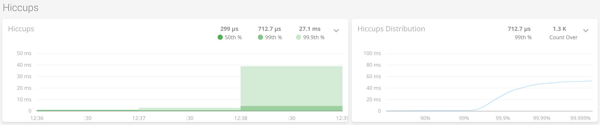

# Testeando Escenarios

## Valores por defecto de default-dispatcher

```
parallelism-min = 8
parallelism-factor = 3.0
parallelism-max = 64
```

Esto significa que la cantidad de theads va a ser igual a la cantidad de procesadores multiplicado por
parallelism-factor, teniendo como mínimo parallelism-min y como máximo parallelism-max.  
Por ejemplo:

* Si la cantidad de procesadores es 2, 2 * 3 = 6, pero dado que el mínimo es 8, se crearán 8 theads.
* Si la cantidad de procesadores es 8, 8 * 3 = 24, dado que es un valor entre 8 y 64, 24 será la cantidad máxima de theads que se crearán.
* Si la cantidad de procesadores es 36, 36 * 3 = 108, pero dado que el máximo es 64, se crearán hasta 64 threads.

## Info

Todos los tests corren con 8 procesadores y comparten recursos con gatling.

Todos los tests corren los siguientes escenarios:

* Creación de un evento
* Actualización de un evento
* Listar eventos
* Eliminar evento

Los distintos escenarios dentro de cada test corren en paralelo.

## Caso 1 - Cold VM, default dispatcher con valores default

### Cantidad de usuarios

Cada escenario corre con la siguiente configuración:

1. Un usuario desde el inicio
1. Rampa de 1 a 10 usuarios en 20 segundos
1. 10 usuarios constantes por otros 20 segundos

### Reporte de gatling

https://leonhardtdavid.github.io/arq2/doc/caso1

### Kamon APM


## Caso 2 - VM precalentada, default dispatcher con valores default

### Cantidad de usuarios

Cada escenario corre con la siguiente configuración:

1. Un usuario desde el inicio
1. Rampa de 1 a 10 usuarios en 20 segundos
1. 10 usuarios constantes por otros 20 segundos

### Reporte de gatling

https://leonhardtdavid.github.io/arq2/doc/caso2

### Kamon APM


## Caso 3 - VM precalentada, default dispatcher con máximo de threads en 8

### Cantidad de usuarios

Cada escenario corre con la siguiente configuración:

1. Un usuario desde el inicio
1. Rampa de 1 a 10 usuarios en 20 segundos
1. 10 usuarios constantes por otros 20 segundos

### Reporte de gatling

https://leonhardtdavid.github.io/arq2/doc/caso3

### Kamon APM





## Caso 4 - VM precalentada, default dispatcher con valores default, 210 usuarios concurrentes promedio

### Cantidad de usuarios

Cada escenario corre con la siguiente configuración:

1. Un usuario desde el inicio
1. Rampa de 1 a 5 usuarios en 60 segundos
1. 5 usuarios constantes por otros 10 minutos

### Reporte de gatling

https://leonhardtdavid.github.io/arq2/doc/caso4

### Kamon APM


